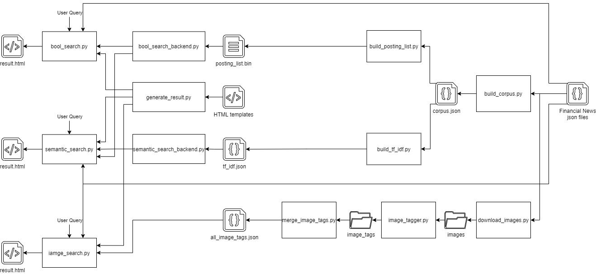

# Web信息处理与应用 Exp1 实验报告

USTChorusWeb2021
PB19000001 江小白
PB19051055 彭浩然

## 目录

[TOC]

## 完成的实验要求

本项目完成了实验手册中的所有基础要求，以及下面几项可选内容：

- 对倒排索引表进行空间压缩，并对布尔检索过程进行时间优化
- 采用同义词表对语义检索进行优化
- 支持图片查询，返回最相关的10张图片

除了以上的内容外，本项目还额外实现了以下改进：

- 支持任意布尔表达式的解析，并对不合法的表达式报错
- 使用布尔检索预处理来加速语义检索
- 检索结果的可视化展示

具体实现将在后文中详细介绍。

## 关键性能指标

### 索引大小及建立耗时

针对全部数据集生成的几个关键索引文件，其大小和建立耗时如下：

| 文件名           | 描述             | 大小  | 建立耗时 |
| ---------------- | ---------------- | ----- | -------- |
| corpus.json      | 语料库文件       | 823MB | 约50min  |
| posting_list.bin | 压缩的倒排索引表 | 115MB | 约2min   |
| tf_idf.json      | tf-idf矩阵       | 385MB | 约7min   |

### 检索延迟

在ThinkPad X1 Yoga 4th（Intel Core i5 8265U, 8GB RAM）平台上执行几个典型检索任务，需要的时间如下：

| 检索类别     | 检索式                                                       | 耗时     |
| ------------ | ------------------------------------------------------------ | -------- |
| 简单布尔检索 | `search finance AND company`                                 | 0.07867s |
| 复杂布尔检索 | `search war UND (iraq OR iran) AND (NOT (britain OR england) AND NOT (us OR usa OR america)) AND australia` | 0.11812s |
| 简单语义检索 | `search tax`                                                 | 0.63464s |
| 复杂语义检索 | `search china america trade war`                             | 5.84842s |

## 使用说明及效果展示

### 运行环境

本项目中的所有代码都运行于Windows 10 (21H1)环境下的Python 3.9.7平台，并需要通过pip安装NLTK、wget等库。操作系统环境理论上该对本项目的运行不会起到影响，但并未经过测试。

**提交包中不包含原始数据文件，运行前需要手动放置到根目录下的`./dataset/US_Financial_News_Articles`文件夹内。**

**需要特别强调的是，由于需要使用到相对路径，运行每个程序前，请保证当前工作目录和程序所在目录一致。**

### 布尔检索

运行`bool_search.py`，进入布尔检索控制台界面。


```
Welcome to USTChorusWeb2021 bool search console.
Enter "help" for help.
>>
```

检索前先需要使用`load`命令将倒排索引表加载进入内存，否则检索时会报错。

```
>> load
Loading posting list from "../output/posting_list.bin"
This may take about 20 seconds
Load complete
>>
```

使用`search`命令后接布尔表达式进行布尔检索。本项目的布尔检索支持任意合法的布尔表达式，通过语法分析器自动解析优先级，不对括号层级设限，并可以检查出非法的表达式。这里使用一个错误的表达式`war UND (iraq OR iran) AND (NOT (britain OR england) AND NOT (us OR usa OR america)) AND australia`和一个正确的表达式`war AND (iraq OR iran) AND (NOT (britain OR england) AND NOT (us OR usa OR america)) AND australia`分别进行测试。

```
>> search war UND (iraq OR iran) AND (NOT (britain OR england) AND NOT (us OR usa OR america)) AND australia 
Received query string:
war UND (iraq OR iran) AND (NOT (britain OR england) AND NOT (us OR usa OR america)) AND australia
SyntaxError: wrong query format
>> search war AND (iraq OR iran) AND (NOT (britain OR england) AND NOT (us OR usa OR america)) AND australia
Received query string:
war AND (iraq OR iran) AND (NOT (britain OR england) AND NOT (us OR usa OR america)) AND australia
Resolved boolean expression: 
(war AND ((iraq OR iran) AND (((NOT (britain OR england)) AND (NOT (us OR (usa OR america)))) AND australia)))
Finished searching in 0.11812353134155273 seconds
Found 7 matching result(s)
Result page generated
>>
```

检索完成后，程序会在`./ouput`目录下生成`result.html`并用默认浏览器打开，可视化地呈现检索结果。


如果结果过多，则只会展示20条，并在页面底部简单显示所有结果的列表。

```
>> search finance OR china 
Received query string:
finance OR china
Resolved boolean expression: 
(finance OR china)
Finished searching in 0.0574183464050293 seconds
Found 52499 matching result(s)
Result page generated
>>
```


### 语义检索

运行`semantic_search.py`，进入语义检索控制台界面。

```
Welcome to USTChorusWeb2021 semantic search console.
Enter "help" for help.
>> 
```

检索前先需要使用`load`命令将倒排索引表（用于加速搜索）和tf-idf矩阵加载进入内存，否则检索时会报错。

```
>> load
Loading posting list from "../output/posting_list.bin"
This may take about 20 seconds
Loading tf-idf matrix from "../output/tf_idf.json"
This may take about 5 seconds
Load complete
>>
```

使用`search`命令后接用空格分隔的关键词进行语义检索。

```
>> search china america trade war
Received query: 
['china', 'america', 'trade', 'war']
Synonym search disabled
Bool search preprocessing enabled
Finished searching in 5.848416566848755 seconds
Best matches:
[(7.38767, '2018_04/news_0011651'), (6.81611, '2018_04/news_0004475'), (6.6403, '2018_03/news_0045305'), (6.63621, '2018_04/news_0044003'), (6.62119, '2018_05/news_0002784'), (6.60238, '2018_04/news_0018427'), (6.543430000000001, '2018_03/news_0044286'), (6.542909999999999, '2018_04/news_0001996'), (6.52627, '2018_03/news_0056353'), (6.52627, '2018_03/news_0049467')]
None
Result page generated
>>
```

检索完成后，程序会在`./ouput`目录下生成`result.html`并用默认浏览器打开，可视化地呈现检索结果。


#### 使用同义词库优化的语义检索

进行语义检索时，可以通过加入`-s`选项来启用同义词库检索。这会使检索速度大大下降，但是可以得到更加差异化的搜索结果。

以单词aeroplane为例，不启用同义词库时，搜索时间和搜索结果如下所示：

```
>> search aeroplane
Received query: 
['aeroplane']
Synonym search disabled
Bool search preprocessing enabled
Finished searching in 0.0 seconds
Best matches:
[(5.73715, '2018_05/news_0020052'), (5.73715, '2018_05/news_0017692'), (5.73715, '2018_05/news_0013363'), (5.05321, '2018_05/news_0037689'), (5.05321, '2018_04/news_0025624'), (3.884, '2018_05/news_0040726'), (3.884, '2018_05/news_0040041'), (3.884, '2018_05/news_0038161'), (3.884, '2018_05/news_0024363'), (3.884, '2018_05/news_0019648')]
None
Result page generated
>>
```


加入`-s`选项，除了aeroplane外，更多以airplane和plane为关键词的文章也得到了展示。

```
>> search -s aeroplane 
Received query: 
['aeroplane']
Synonym search enabled
Bool search preprocessing enabled
Query with synonyms
['airplane', 'aeroplane', 'plane']
Finished searching in 5.325649261474609 seconds
Best matches:
[(9.348320000000001, '2018_02/news_0031666'), (8.978909999999999, '2018_02/news_0019968'), (8.43044, '2018_02/news_0030774'), (8.3081, '2018_04/news_0022018'), (8.29341, '2018_02/news_0001382'), (8.26142, '2018_02/news_0063596'), (8.16834, '2018_02/news_0021421'), (7.9331, '2018_04/news_0038959'), (7.9331, '2018_04/news_0032211'), (7.9331, '2018_04/news_0030358')]
None
Result page generated
>> 
```


### 图片检索

运行`image_search.py`，进入图片检索控制台界面。

```
Welcome to USTChorusWeb2021 image search console.
Enter "help" for help.
>>  
```

检索前先需要使用`load`命令将图片标签库加载进入内存，否则检索时会报错。

```
>> load
Loading image tags from "../output/image_tags/all_image_tags.json"
This may take about 3 seconds
Load complete
>> 
```

使用`search`命令后接用空格分隔的关键词进行图片检索。

```
>> search building glass
Received query string: 
building glass
Finished searching in 0.021585702896118164 seconds
Result page generated
>>
```

检索完成后，程序会在`./ouput`目录下生成`result.html`并用默认浏览器打开，可视化地呈现检索结果。将鼠标停留在图片上可以查看confidence、相关新闻等信息，点击图片可以追踪其URL来源。


## 架构设计



本项目的架构大体可以分为两个部分：索引生成部分和前端部分。其中，索引生成部分负责对原始数据进行提取、分析、组织、压缩等操作，生成便于前端进行高效检索的数据结构。前端部分则直接将这些索引数据加载入内存，借助于数据结构和相关算法，实现对用户查询的快速响应和可视化展示。

在这种架构下，各个模块之间耦合度低、功能重复少、代码复用率高。通过文件作为各个程序之间交互的接口，既可以及时保存中间结果，避免大规模的重复计算，也可以将接口和实现分离，增大模块内部实现和优化的自由度。

在不同模块之间任务负担的平衡上，本项目总体倾向于将尽可能多的工作在幕后完成，从而减少用户需要在前端需要等待的时间，优化用户体验。考虑到本次实验中较大的数据规模，索引生成部分的程序通常有较大的计算量，因此在台式机上部署。通过这一精细化的数据组织过程，前端仅需依靠生成的索引文件即可高效地完成检索任务，因而可以部署在更轻量级的平台上。

### 索引生成

#### `build_corpus.py`

该部分实现的功能为：通过遍历数据集文件夹，初步生成`.json`格式的语料库文件。
- 遍历数据集文件夹：利用Python的`os`库中的`listdir`函数，对五个子文件夹按照顺序遍历其中的每个json文件，并进行处理
- 分句与分词处理：利用NLTK自然语言处理库中的`sent_tokenize`和`word_tokenize`函数进行初步分词。在此步骤中，使用Python标准库中的`isalpha`函数判断当前token是否为英文单词
- 停用词处理：利用NLTK库中的`stopwords`初始化英文停用词库，对于每个词项判断其是否为停用词
- 词根化处理：利用NLTK中的`PorterStemmer`实例化一个可以对当前词项进行词根化的对象，若其不是停用词，则词根化后加入当前文档对应的词项列表
- 路径压缩：将当前文档的路径初步压缩为一个字符串
- 语料库结构：最终生成的`corpus.json`文件对应Python数据结构中的`list`结构，其中的每一个元素均为一个字典，含有两个字段：`Path`字段对应压缩后的路径，`text`字段为处理后的词项列表

#### `build_posting_list.py`

该部分实现的功能为：遍历上一步生成的语料库文件`corpus.json`，生成以二进制格式存储的倒排索引表`posting_list.bin`。
- 二进制写功能实现：利用Python内置的`to_bytes`方法，可以以字节为单位生成二进制存储的数据，再进行写入
- 倒排索引过程：遍历语料库中的每篇文档，针对每篇文档再分别遍历其中的每个词项。若当前词项在倒排表中已经存在，且当前词项对应的posting list中的最后一个元素不为当前文档，则将当前文档压缩后的路径加入该posting list
- 文档集全集的存储：在遍历语料库时，将每篇文档的路径名称以二进制格式压缩并写入倒排表的最前端部分，并加入一个特殊字节作为文档名集合的结束标志，以供后续查询使用
- 倒排索引表的生成：遍历上述过程中生成的字典结构的`posting_list`，以词项为单位，用自定义的二进制编码格式写入`posting_list.bin`文件。详细编码格式见后文

#### `build_tf_idf.py`

该部分实现的功能为：遍历已经生成的语料库`corpus.json`，计算每个文档对应的`tf-idf`向量，保留其中值最大的前50个词项，存储为`tf_idf.json`。
- 生成弱化版本的倒排表`weak_posting_list`：该部分用于针对每个词项，统计其出现过的文档总数。遍历语料库的每个文档中的每个词项，若其尚未存在于`weak_posting_list`中，则进行对应的初始化；若其已经存在于`weak_posting_list`中且上一次出现的位置并非是当前文档，则进行计数

- 词数统计：该部分用于统计每篇文档中各单词的出现频数。直接遍历语料库中每个文档中的每个词项进行相关统计，存储在字典`word_stat_dict`中

- `tf-idf`值的计算：遍历`word_stat_dict`中的每篇文档，利用公式 

  $$
  tf = \log_{10}(\mathtt{word\_stat\_dict[doc][word]}) + 1
  $$
  和
  $$
  idf = \log_{10}\frac{\mathtt{doc\_total}}{\mathtt{weak\_posting\_list[word].count}}
  $$
  计算当前文档中某个词项的`tf-idf`值。计算当前文档中某个词项的`tf-idf`值。
> 这里没有对每个文档的`tf-idf`向量进行归一化处理，且在后续的`semantic_search.py`文件中直接采取了内积的方式进行计算（而非计算余弦值），是因为我们发现这样做的搜索效果优于归一化处理后的搜索效果（或计算余弦值的搜索效果）。
> 事实上，如果进行对向量长度进行归一化处理，则搜索结果会更偏好短文章，如下图所示。我们猜测，这是由于长文章会多次重复关键词，而造成保留的50个`tf-idf`值（见下文说明）均较大，而归一化的做法会过分地削弱值的大小，使得搜索结果的优先级与文档长度呈现负相关的特性。
> 
- 存储的优化
    - 由于存储完整的`tf-idf`矩阵会消耗较大的存储空间，且考虑到一般而言对搜索起到决定性作用的仅有一篇文章中权值较大的数十个关键词，因此对于每篇文章，我们只选取`tf-idf`值最大的前50个词进行存储。这一功能通过使用Python库中的优先队列类`PriorityQueue`维护一个`qsize = 50`的小根堆来实现，当`qsize > 50`时，利用`q.get()`方法将最小的元素取出
    - 存储`tf-idf`值时，利用Python`math`库中的`round`函数，只保留小数点后5位，生成的`tf-idf`文件大小约为原先的2/3

### 前端

前端负责获取用户查询，通过索引文件快速得到检索结果，并生成可视化的展示。

前端大体可以分为两部分：与索引文件或模板文件直接交互并提供服务接口的服务程序，和为用户提供交互界面的命令行程序。前者包括`bool_search_backend.py`、`semantic_search_backend.py`和`generate_result.py`，而后者包括`bool_search.py`、`semantic_search.py`。较为特殊的是`image_search.py`：由于图片检索的特殊性，它同时包括了上述两者的功能。

#### 布尔检索

##### `bool_search_backend.py`

布尔检索的服务由`bool_search_backend.py`提供。它通过一个`BoolSearcher`对象，完成对倒排索引表的加载和对词根化处理器的维护，最终提供一个布尔检索接口，对用户提供的表达式进行解析、处理，并最终返回满足检索式的结果列表。一次典型的检索流程如下：

- `boolSearch()`方法得到用户的检索式
- 对检索式进行LL(1)文法自顶向下分析，构建解析树（parse tree）
- 对解析树进行化简，得到抽象语法树（AST, abstract syntax tree）
- 对AST上的id节点进行词根化处理
- 通过对AST的递归访问，计算布尔表达式的语义值，即其所对应的文章列表（此步骤有特殊优化，会在后文中详细介绍）
- 返回AST根节点对应的文章列表，即满足检索式的结果列表

##### `bool_search.py`

与用户通过命令行交互的任务由`bool_search.py`完成。它实现了一个类似shell的交互界面，通过不同命令调用相关的服务程序，并将结果呈现给用户。具体的操作流程如下：

- `search`命令将用户的检索式传递给`BoolSearcher`对象，得到检索结果列表
- 将检索耗时等运行信息打印在命令行中
- 将结果列表传递给`generate_result.py`中的`ResultGen`对象，得到其生成的`result.html`
- 调用默认浏览器打开`result.html`

#### 语义检索

##### `semantic_search_backend.py`

布尔检索的服务由`semantic_search_backend.py`提供。它通过一个`SemanticSearcher`对象，完成对倒排索引表、tf-idf矩阵的加载以及对词根化处理器的维护，最终提供一个语义检索接口，对用户提供的关键词在其提供的检索范围进行语义向量计算、排序，最终返回最相关的10个结果。一次典型的检索流程如下：

- `semanticSearch()`方法得到用户的检索关键词，以及限定的检索范围
- 对关键词进行词根化处理
- 在范围内，计算关键词语义向量与每篇文档的语义向量的内积，作为该篇文档的rating
- 维护一个容量为10的优先队列，在遍历检索范围的过程中只保留前10的结果
- 遍历结束后，返回结果列表及每一个结果对应的rating

##### `semantic_search.py`

与用户通过命令行交互的任务由`semantic_search.py`完成。它实现了一个类似shell的交互界面，通过不同命令调用相关的服务程序，并将结果呈现给用户。具体的操作流程如下：

- `search`命令接收用户的关键词
- 如果用户开启了同义词检索选项（默认关闭，使用`-s`开启），则将同义词库中的同义词加入关键词列表（这是一项功能优化，将在后文中详细介绍）
- 如果用户开启了布尔检索预处理优化选项（默认开启，使用`-n`关闭），则将关键词用`OR`连接后，传递给传递给`BoolSearcher`对象，先通过布尔检索对语义检索范围进行限定；否则将检索范围设为所有文档（这是一项性能优化，将在后文中详细介绍）
- 将检索范围和检索关键词传递给`SemanticSearcher`对象，得到语义检索结果
- 将检索耗时、每个结果的rating等信息打印在命令行中
- 将结果列表传递给`ResultGen`对象，得到其生成的`result.html`
- 调用默认浏览器打开`result.html`

#### 图片检索

不同于布尔检索和语义检索，图片检索不依赖于对语料库的分析，而依赖于每个图片的语义标签。要得到语义标签，需要对图片进行下载、识别、整合等操作，是一条全然不同的工作流程。

考虑到图片占用空间大、API调用次数有限等实际情况，本项目中的图片检索仅针对数据集中2018年01月的blogs文章内的插图，总共略超过1000张。

##### 图片语义标签生成

从原始数据集到图片语义标签文件，大体经过下面几步：

- `download_images.py`将原始数据集中`main_image`字段所对应的图片下载至`./output/images`中
- `image_tagger.py`调用Imagga的免费API，对`./output/images`中的每个图片进行语义识别，将返回的json文件放置在`./output/image_tags`内；每个图片包含多个标签，且每个标签对应有一个confidence值，作为这个图片的语义向量
- `merge_image_tags.py`将`./output/image_tags`内每个图片的语义标签json文件进行合并，得到`all_image_tags.json`，此即为所有图片的语义标签文件

##### `image_search.py`

`image_search.py`同时实现了命令行交互界面和对`all_image_tags.json`的访问。一次典型的图片检索中，工作流程如下：

- `search`命令接收用户的关键词，进行词根化处理
- 计算关键词语义向量与每个图片语义向量的内积，作为该图片的rating
- 维护一个容量为12的优先队列，在遍历检索范围的过程中只保留前12的结果
- 将检索耗时、每个结果的rating等信息打印在命令行中
- 将结果列表传递给`ImageResultGen`对象，得到其生成的`result.html`
- 调用默认浏览器打开`result.html`

## 优化与特色设计

### 倒排索引表的空间压缩

起初，我们采用`json`格式存储倒排索引表，生成的`posting_list.json`大小为453MB。为了尽量优化倒排索引表的空间复杂度，我们决定使用自定义的二进制格式进行存储优化。存储格式如下：
- 对于每篇文档的路径，我们采用以下格式存储：

| 23 ~ 20 | 19 ~ 17              | 16                | 15 ~ 0             |
| ------- | -------------------- | ----------------- | ------------------ |
| 0       | 文件夹序号（二进制） | blog: 0 / news: 1 | 原始文件名中的编号 |

例如`2018_01/news_0000003.json`，对应的编码为：`00000011 00000000 00000011`
- 在倒排索引表的最前端，先存储文件名全集，并以`EOFL` （End of Filename List）作为文件名存储的结束标记。`EOFL = 24'b0`，即占用3个字节的0
- 对于每个单词，我们采用如下格式存储：对于单词中的每个字母，先利用Python库函数 `ord` 将其转换为其对应的`ASCII`码值，再进行二进制存储。因此，每个字母占用一个字节，并且以 `EOF`（End of Word）作为单词结束的标记。`EOF = 8'b0`，即占用1个字节的0
- 对于每个单词对应的倒排列表，我们采用如下格式来存储：

| 23     | 22 ~ 20 | 19 ~ 17    | 16                 | 15 ~ 0             |
| ------ | ------- | ---------- | ------------------ | ------------------ |
| 标志位 | 0       | 文件夹序号 | blog: 0 / news : 1 | 原始文件名中的编号 |

其中标志位被置为1时，说明当前存储的文档为当前单词对应的倒排列表中的最后一篇文档。

### 基于布尔减法运算的布尔检索加速

在布尔检索时，注意到这样一个现象：包含某个关键词的文章数，通常远远小于不包含某个关键词的文章数。例如，在所给财经相关数据集中，含有`money`的文章数也只有不到20000，而总文章数在300000以上。由于布尔检索的过程实际上为表合并的过程，因而若存在含`NOT`的表达式，其处理过程中的表长会以十倍甚至上百倍的规模增加，极大地拖慢检索速度。

因此，我们提出了一个方案，可以在运算过程中避免真正对变量取反从而造成表长急剧膨胀。取而代之的是，如果出现了一个`NOT A`表达式，我们使该表达式的表仍然存储包含`A`而非不含`A`的文章名，但在表头做额外标记。若在计算过程中对该表达式取非，则只需简单改变标记。不仅如此，我们还提出了一种方法，使得所有与、或操作均可直接在带标记的表上进行，从而大大加快了检索速度。

为了方便描述，先引入表之间的减法运算定义：

$$
A - B := \{x\,|\,x\in A, x \notin B\}
$$

以$\bar{A}$表示在表头带`NOT`记号的表`A`，则直接在带标记的表上进行的与、或运算可以如下操作：

$$
AB = AB\\
A\bar{B} = A - B\\
\bar{A}\bar{B} = \overline{A + B}\\
A + B = A + B\\
A+\bar{B} = \overline{B - A}\\
\bar{A}+\bar{B} = \overline{A B}
$$

上面的6种情况已经穷尽了带`NOT`标记的表的布尔运算的所有情况，并全部可以在线性时间内完成。在式子化简到只剩一项时，如果仍然有`NOT`标记，则只需进行至多一次取反操作即可得到最终结果。

### 基于LL(1)文法的通用布尔表达式解析

为了实现对任意合法布尔表达式的解析，并识别出不合法的布尔表达式，提高程序的通用性和健硕性，在布尔检索的前端部分，我们实现了一个基于LL(1)文法的自顶向下预测分析器，用以解析用户输入的布尔检索式。

布尔表达式的LL(1)文法如下：

```
OrExp       ->  AndExp OrTailExp
OrTailExp   ->  "OR" OrTailExp | ε
AndExp      ->  UnaryExp AndTailExp
AndTailExp  ->  "AND" AndTailExp | ε
UnaryExp    ->  "(" OrExp ")" | "NOT" UnaryExp | id
```

其中，`id`终结符是将用户输入的表达式按照空格进行拆分、排除关键字后的任意字符串。

为避免左递归文法，文法本身存在一些冗余，解析器最初得到的解析树会有较多空节点。例如，对于检索式`search finance OR cash`，得到的初始解析树是：

```
((finance AND (NONE AND NONE)) OR ((cash AND (NONE AND NONE)) OR (NONE OR NONE)))
```

接下来，对解析树进行一次遍历的同时进行化简，得到最终的抽象语法树（AST）表示：

```
(fiance OR cash)
```

后期的布尔运算均基于该AST。

### 基于同义词表的语义检索优化

我们在前端实现了基于`nltk.corpus.wordnet`库的同义词表的语义检索优化。该功能可以在一定程度上增加检索结果的丰富度，但十分耗时，因此默认关闭。如果用户需要，可以在语义检索时开启`-s`选项。

我们对同义词表的使用基于以下简单的方法：对于检索关键词列表里的每一个词，将其所有同义词一并加入检索关键词列表。

我们并未对加入的同义词赋予更低的权重，是基于两点考虑：

- 功能上，当用户开启同义词表优化选项时，通常是因为先前检索的结果无法满足用户的需求，此时用户会更希望得到差异化的结果，而非先前结果的重复，因此没有必要强调原词的权重
- 性能上，引入权重将会大量增加浮点乘法运算，为本就低效的Python雪上加霜

一个使用同义词表得到更多检索结果的例子可以在前文展示部分找到。

### 基于布尔检索预处理的语义检索的时间优化

由于本次实验原始数据量较大，总共有超过300000篇文章，因此在进行语义检索时，直接将检索式的语义向量和所有文章执行语义向量进行比较，会导致非常大的运算量。

我们注意到一个现象：如果检索式的语义向量和某篇文章的语义向量（作为集合）完全没有交集，则最后的相似度一定是0，无需进一步运算。事实上，布尔检索的经验告诉我们，即使是很常见的关键词，如`finance`，在所有文章中也仅占很小一部分。

因此，我们提出一种优化方法：在进行语义向量的比较前，先将检索式种的关键词使用`OR`连接，形成一个布尔检索式，执行一遍速度较快的布尔检索作为预处理，由此对语义检索的有效范围进行限定。通过这种方法，我们可以大大加快语义检索的速度。

通过在语义检索时打开或关闭`-n`开关，我们对于该方法在不同情况下对性能的优化效果进行对比。

对于单一一个关键词`finance`的检索，不启用该优化时耗时8.21643s，启用优化后仅用0.57563s。


对于较复杂的检索`china america trade war`，22.44035s，启用优化后仅用8.65795s。


可见该方法对于不同规模的检索均有显著的性能优化。

### 基于HTML的搜索结果可视化展示

为了使检索结果更加直观，便于评估检索的效果，我们使用`generate_result.py`和两个html模板文件对于每一次检索生成检索结果的html文件，并用默认浏览器打开。

对于布尔检索和语义检索，html页面上展示检索式、结果数量、检索用时等必要信息，并对每一个检索结果，展示其标题、编号、来源、日期和部分内容。

对于图片检索，html页面上展示12个图片。如果将鼠标停留在图片上方，可以看到编号、confidence等信息。点击图片则可以追踪图片的来源。

